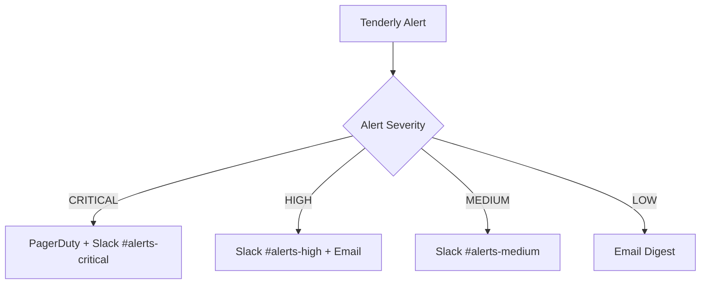

# On-Chain Monitoring Setup Guide

## Tenderly Integration for Tachi Protocol

### Contract Addresses to Monitor

#### Base Sepolia (Testnet)
- **PaymentProcessorUpgradeable**: `0x5a9c9Aa7feC1DF9f5702BcCEB21492be293E5d5F`
- **ProofOfCrawlLedgerUpgradeable**: `0xeC3311cCd41B450a12404E7D14165D0dfa0725c3`
- **TachiMultiSig**: `0x1C5a9A0228efc875484Bca44df3987bB6A2aca23`
- **CrawlNFTMultiSig**: `0xD9d4C72B7bbc8CD4728841DB9576dEDd5d5AC5C1`

#### Base Mainnet (Production)
- **PaymentProcessorUpgradeable**: `TBD`
- **ProofOfCrawlLedgerUpgradeable**: `TBD`
- **TachiMultiSig**: `TBD`
- **CrawlNFTMultiSig**: `TBD`

### Critical Alerts Configuration

#### 1. Failed Transactions (Priority: CRITICAL)
```javascript
// Alert Conditions
- Function: PaymentProcessor.forwardPayment() fails
- Function: PaymentProcessor.batchForwardPayments() fails
- Function: ProofOfCrawlLedger.logCrawl() fails
- Any transaction to multi-sig contracts fails

// Response: Immediate PagerDuty alert + Slack notification
```

#### 2. Anomalous State Detection (Priority: HIGH)
```javascript
// PaymentProcessor State Anomaly
- USDC balance > 0 for more than 5 minutes
- Alert if balance exceeds 10 USDC (should always be ~0)

// ProofOfCrawlLedger Anomalies
- Total crawls logged decreases (impossible in append-only ledger)
- Unusual spike in crawl logging (>1000 logs per hour)
```

#### 3. Administrative Actions (Priority: CRITICAL)
```javascript
// Upgrade Events
- upgradeTo() called on any proxy
- transferOwnership() called
- Any multi-sig transaction execution

// Security Events
- Emergency pause functions (if implemented)
- Recovery function calls
```

#### 4. Volume Monitoring (Priority: MEDIUM)
```javascript
// Traffic Spikes
- CrawlLogged events > 100 per 10-minute window
- Payment events > 50 per 10-minute window
- Failed transaction rate > 5% over 1-hour window
```

### Implementation Steps

1. **Create Tenderly Project**
   ```bash
   # Visit: https://dashboard.tenderly.co/
   # Create new project: "Tachi-Protocol"
   ```

2. **Add Contracts**
   ```bash
   # For each contract address:
   # 1. Go to Contracts tab
   # 2. Add contract by address
   # 3. Verify source code
   # 4. Set up ABI
   ```

3. **Configure Webhooks**
   ```javascript
   // Webhook URL for PagerDuty integration
   POST /services/{integration-key}/events/v2
   
   // Webhook URL for Slack integration
   POST https://hooks.slack.com/services/{workspace}/{channel}/{token}
   ```

### Alert Routing Strategy



### Tenderly Dashboard Setup

1. **Contract Overview Dashboard**
   - Transaction success/failure rates
   - Gas usage trends
   - Function call frequency
   - State variable monitoring

2. **Security Dashboard** 
   - Multi-sig transaction monitoring
   - Upgrade event tracking
   - Ownership change alerts
   - Failed administrative calls

3. **Performance Dashboard**
   - Transaction throughput
   - Gas optimization opportunities
   - State bloat monitoring
   - Cost analysis
